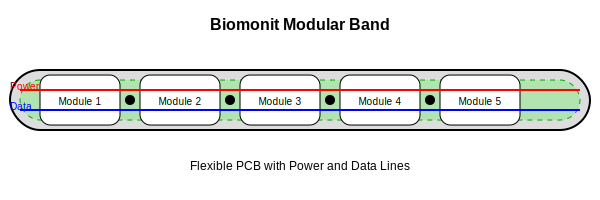

# [smartband](smartband.biomonit.com)

Rozumiem, dziękuję za doprecyzowanie. Stworzę nowy projekt, który będzie bazował na koncepcji opaski z modułową konstrukcją, wykorzystującą elastyczne PCB i złącza do zasilania i przesyłu danych. Taka konstrukcja zapewni większą elastyczność i możliwość dostosowania do różnych zastosowań.

Oto nowy projekt Biomonit w formie modułowej opaski z elastycznym PCB:

1. Elastyczna opaska: Podstawa urządzenia to elastyczna opaska, która może być dostosowana do różnych rozmiarów i kształtów.

2. Elastyczne PCB: Wewnątrz opaski znajduje się elastyczne PCB, które rozciąga się na całej jej długości. To zapewnia elastyczność i trwałość urządzenia.

3. Moduły: Wzdłuż opaski znajduje się pięć slotów na wymienne moduły. Każdy moduł może zawierać różne sensory, wyświetlacze lub inne komponenty.

4. Złącza: Między modułami znajdują się złącza (zaznaczone jako złote kółka), które umożliwiają łatwe podłączanie i odłączanie modułów.

5. Linie zasilania i danych: Przez całą długość opaski biegną dwie linie - czerwona dla zasilania i niebieska dla danych. Zapewniają one połączenie między wszystkimi modułami.

Kluczowe cechy tego projektu:

- Modułowość: Możliwość łatwej wymiany i dodawania różnych modułów w zależności od potrzeb.
- Elastyczność: Opaska może być dostosowana do różnych rozmiarów i kształtów ciała lub obiektów.
- Skalowalność: Możliwość dodawania lub usuwania modułów w zależności od wymagań.
- Łatwość prototypowania: Szybka wymiana modułów umożliwia szybkie testowanie różnych konfiguracji.
- Uniwersalność: Może być używana dla ludzi, zwierząt lub w innych zastosowaniach.
- Niski koszt rozwoju: Możliwość wykorzystania istniejących modułów i sensorów.

Potencjalne zastosowania modułów:
- Moduł z podstawowymi sensorami (np. puls, temperatura)
- Moduł komunikacyjny (np. Bluetooth, WiFi lub komórkowy)
- Moduł zasilania (bateria)
- Moduł wyświetlacza (prosty LCD lub LED)
- Moduł z dodatkowymi, specjalistycznymi sensorami

Ta konstrukcja pozwala na:
- Łatwe dostosowanie urządzenia do różnych zastosowań przez wymianę modułów.
- Szybkie prototypowanie i testowanie różnych konfiguracji.
- Stopniowe ulepszanie produktu przez dodawanie nowych modułów bez konieczności przeprojektowywania całego urządzenia.
- Obniżenie kosztów produkcji i rozwoju dzięki możliwości wykorzystania standardowych komponentów w modułach.

Czy ta koncepcja lepiej odpowiada Twoim wymaganiom? Czy chciałbyś, żebym wprowadził jakieś zmiany lub rozwinął jakieś konkretne aspekty tego projektu?
